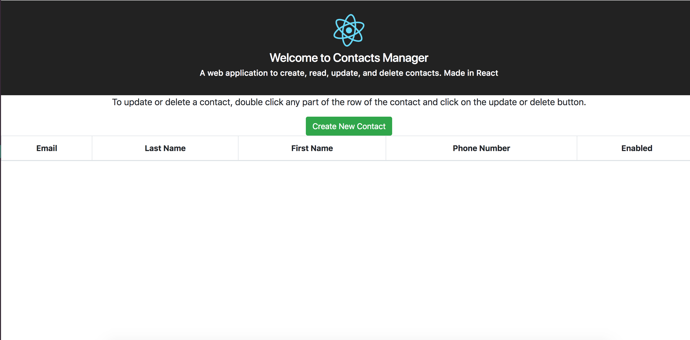
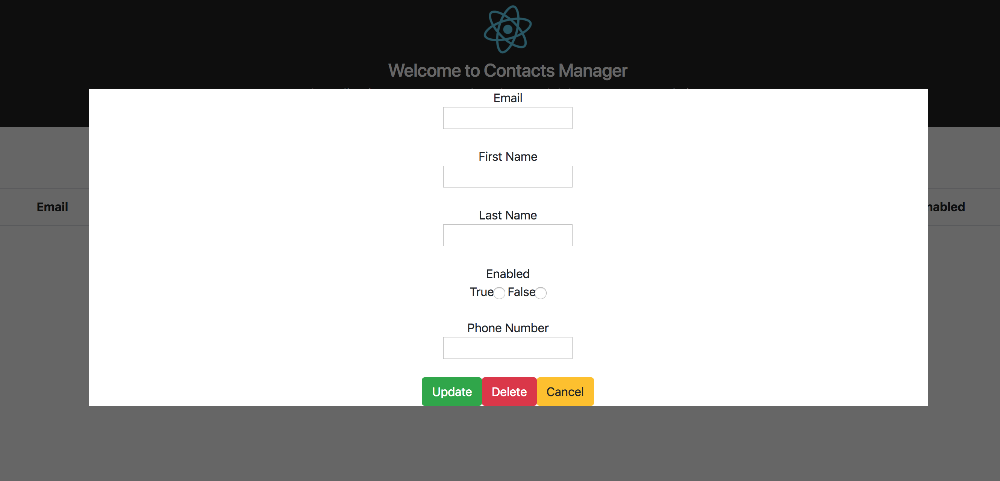
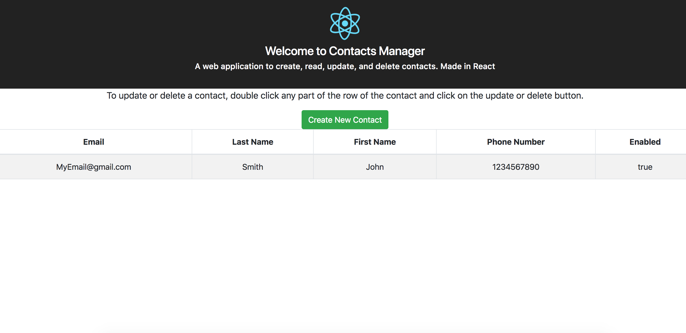
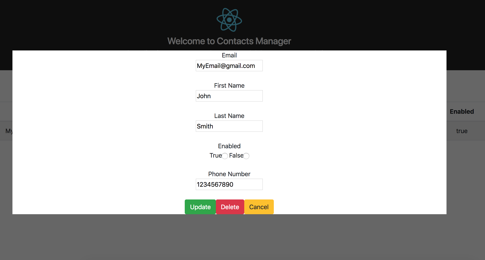
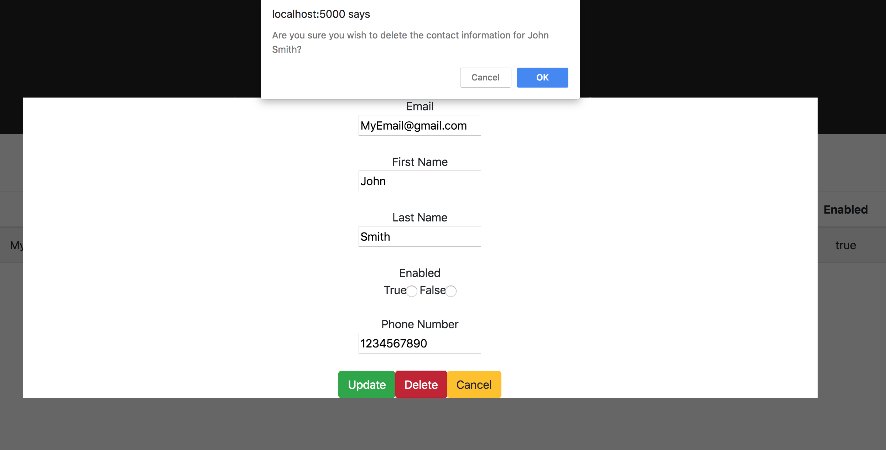

This project was bootstrapped with [Create React App](https://github.com/facebookincubator/create-react-app).

## Introduction
This is a simple CRUD app built in React to keep track of contact information.

## Installation

##### Prerequisites
`node package manager (npm)`

##### Installation process
1. First clone the repo using `git clone https://github.com/kchu1337/React-Contacts-CRUD`
2. Navigate to the repo's location.
3. Run `npm install`.
4. rename `sample_config.js` in `src/configs` to `config.js` and replace the AWS keys with your own. 
5. Run `npm start`. Note , you may need to install `foreman`. In which case first 
run `npm install -g foreman` and then `npm start`.
6. Open your web broswer to `localhost:5000`.

## How to use
##### Create a contact
1. Open your web broswer to `localhost:5000` and you should see the following page.

2. Click the `Create New Contact` button. 
3. A new modal like the one below should open up.

4. Enter in your information and click the `update` button. 
5. The table will now update with your new contact. 

##### Update a contact
1.Double click anywhere in the row of the contact you want to update

3. A new modal like the one below should open up. The contact information text should already be populated.

4. Enter in your information and click the `update` button. 
5. The table will now be updated. 

##### Delete a contact
1.Double click anywhere in the row of the contact you want to delete

3. A new modal like the one below should open up.

4. Click the `Delete` button. 
5. An alert like the one shown below will pop up. Click ok to confirm the delete.

6. Click `OK` and the entry will be deleted and the table will refresh.

## Folder Organization
- File structure was originally created by using `create-react-app`
- The public folder contains all of the static resources.
- The src folder contains the source files for the applications. They are further split into the configs, controllers
helpers, react, and validators folder. It also contains the `server.js` and `index.js` files that run the api and 
webpage respectively.
    - The configs folder contains the configuration files like environment and AWS credentials.
    - The controllers folders contains the controller which handles the api calls.
    - The helpers folder contains files that help other files in their execution
    - The react folder was created by the `create-react-app` script and contains various react components.
    - THe validators folder contains validators for use input.  
- The test folder contains all the test cases. It is split between unit tests and functional tests. 
- The rest of the files are related to running the application. 
